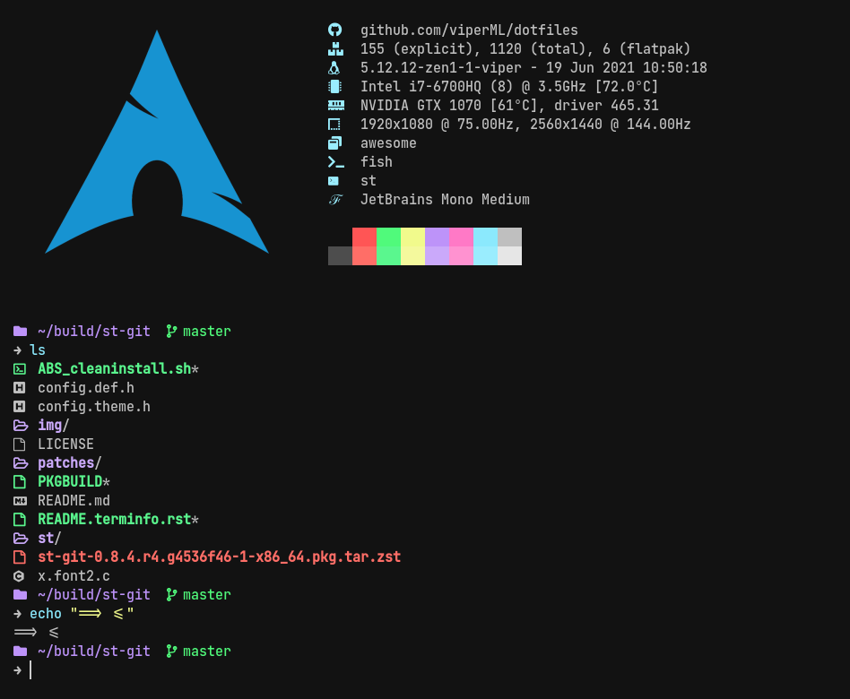

# st

This is my personal patch set of the suckless' [simple terminal](https://st.suckless.org/), with automatic patching for Arch Linux.
The development has used git commit [`4536f46`](https://git.suckless.org/st/commit/4536f46cfff50c66a115755def0155d8e246b02f.html), although
compatibility with other commits may vary.




# Build and install guide

## Gentoo

Copy all the patches to `/etc/portage/patches/x11-terms/st` and install st-9999.


## Arch

Run [`arch_cleaninstall.sh`](arch_cleaninstall.sh). This simple script will:
- Clean previous artifacts
- Diff your config.theme.h, as described in the Manual install section.
- Apply the patches, build and install using the arch build system.


## Manual / Other distributions

- Clone st git repo:

    ```
    $ git clone git://git.suckless.org/st
    ```

- Move the patches into the root directory
- Apply the patches in order, or with this snippet:
    ```
    #!/bin/bash
    for patch in *.diff; do
        echo "Applying patch $patch"
        patch -s -i "$patch"
    done;
    ```
- Build st


# Customizing

To change my horrible color palette / font decisions, you can either:
- Modify [`00-theme.diff`](patches/00-theme.diff) directly.
- Modify [`config.theme.h`](config.theme.h), and diff the result with [`config.def.h`](config.def.h) to create a new theme patch (this is done automatically in the Arch install script with
        ```
        diff -b -u config.def.h config.theme.h > patches/00-theme.diff
        ```


## Attribution
Patches:
- [w3m](https://st.suckless.org/patches/w3m/)
- [desktopentry](https://st.suckless.org/patches/desktopentry/)
- [font2](https://st.suckless.org/patches/font2/)
- [alpha](https://st.suckless.org/patches/alpha/)
- [scrollback](https://st.suckless.org/patches/scrollback/)
- [ligatures](https://st.suckless.org/patches/ligatures/)
- [anysize](https://st.suckless.org/patches/anysize/)
- [openurlonclick](https://www.reddit.com/r/suckless/comments/cc83om/st_open_url/)

[LICENSE](LICENSE)
